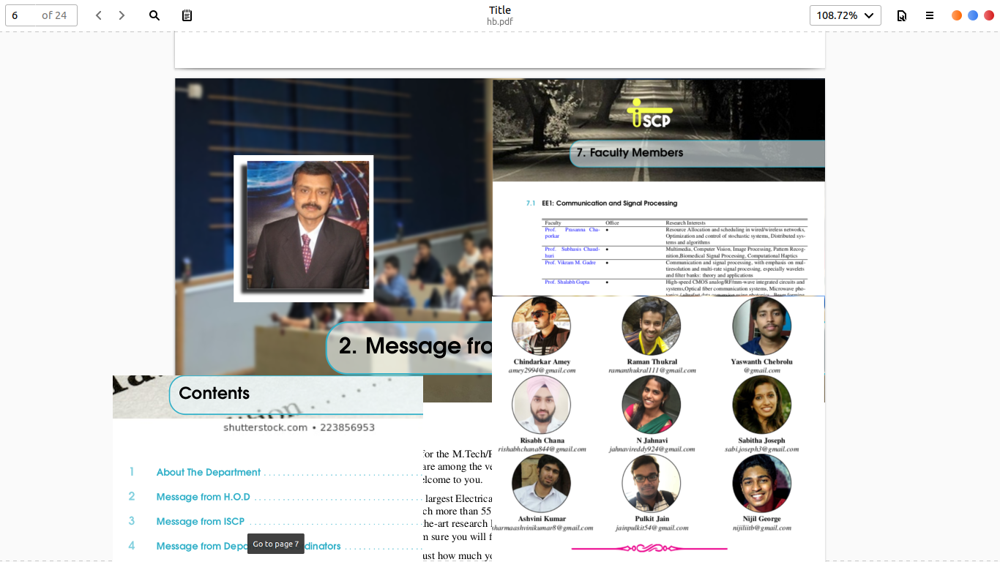

# handbook
A simple latex file to generate department handbook for freshmen mtech students. 


## dependencies 
to generate pdf from tex file , you will need latex installed in your system . you can get it by 
```
    sudo apt-get install texlive-full
```
to pull the code from github; ofcourse you will need git 

```
  sudo apt-get install git 
```
for viewing pdf I am using evince , 
blindly you can copy and paste these lines in your terminal and hope it works :-) 

```
    sudo apt-get install texlive-full git evince -y
    cd 
    git clone https://github.com/aswinpajayan/handbook.git
    cd handbook
    pdflatex hb.tex && evince hb.pdf
```
#### Sources 

This project is just an amalgamation of various projects floating around in internet , GitHub , Overleaf , stack overflow answers extra. References are kept intact 
The original template (the Legrand Orange Book Template) can be found here --> http://www.latextemplates.com/template/the-legrand-orange-book
% Original author of the Legrand Orange Book Template:
% Mathias Legrand (legrand.mathias@gmail.com) with modifications by:
% Vel (vel@latextemplates.com)

Direct port of  https://www.overleaf.com/articles/clustering-the-interstellar-medium/mtthgyyfrdkn'

All the paths are relative. So copy the entire directory if you are not cloning 

### Contributors
Sabitha Susan
Indrani Mukherjee
Sunny Mehta

Data was collected by iscp team ee-iitb


